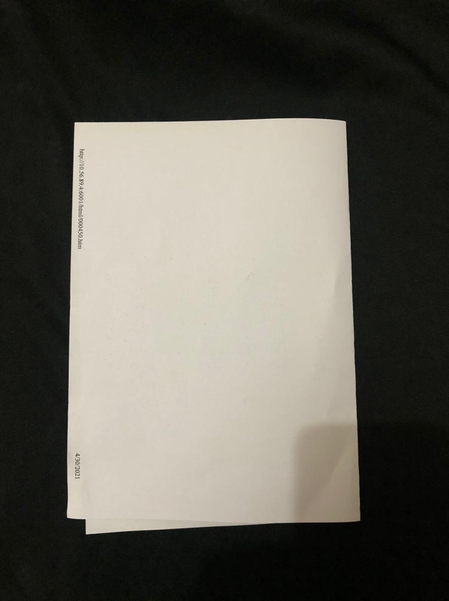
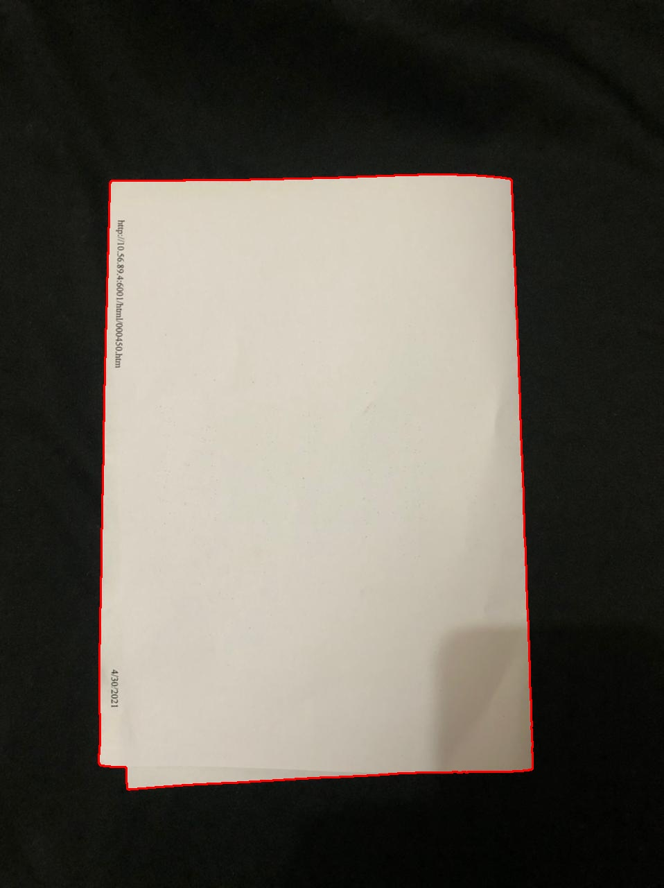
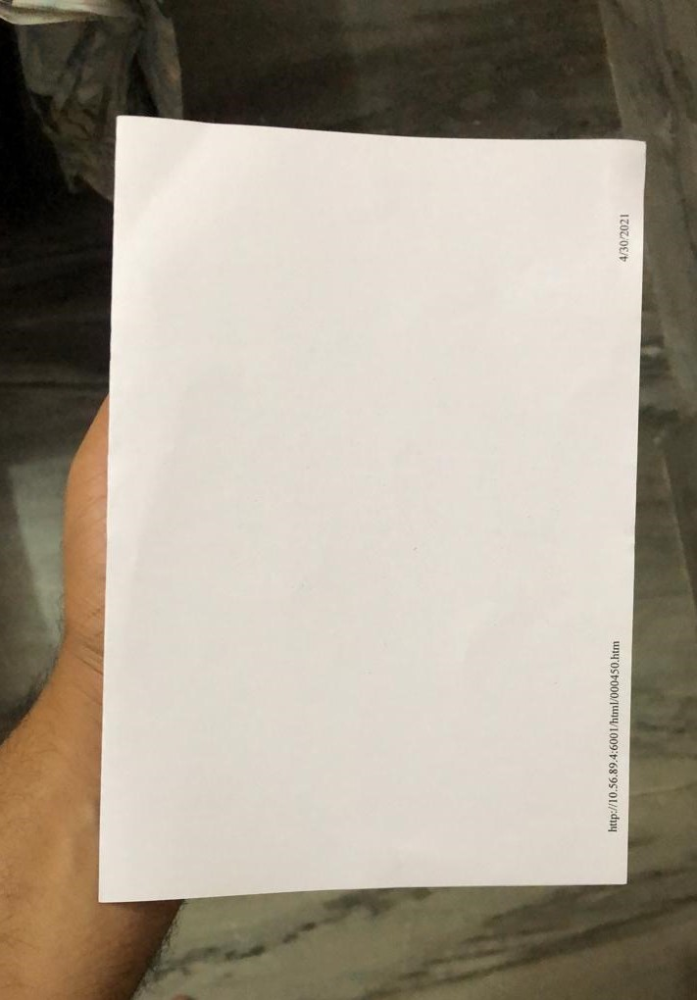
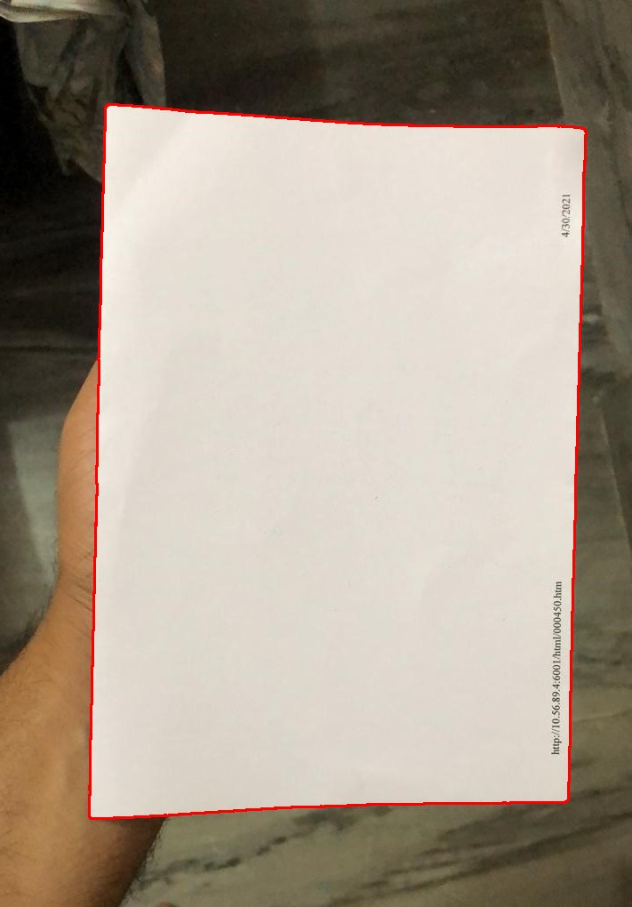
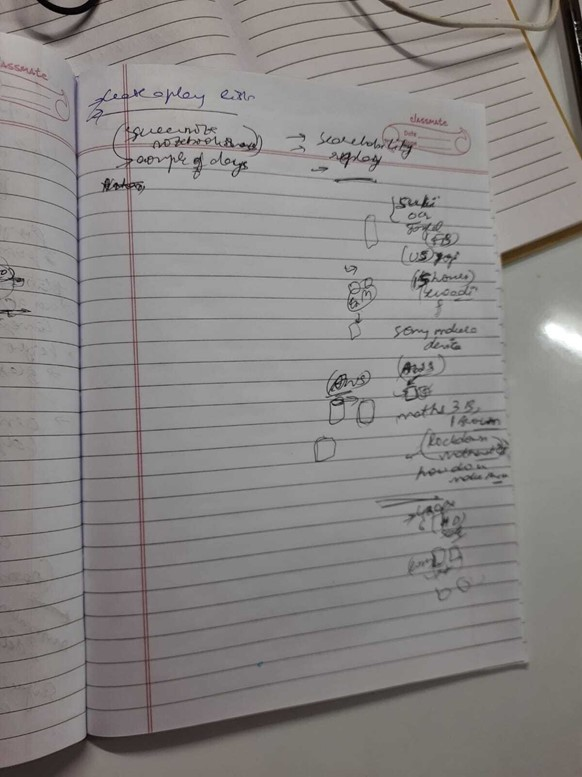
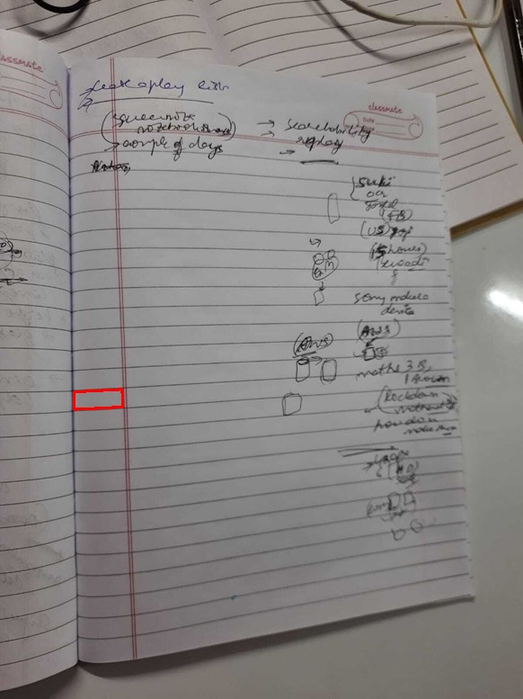
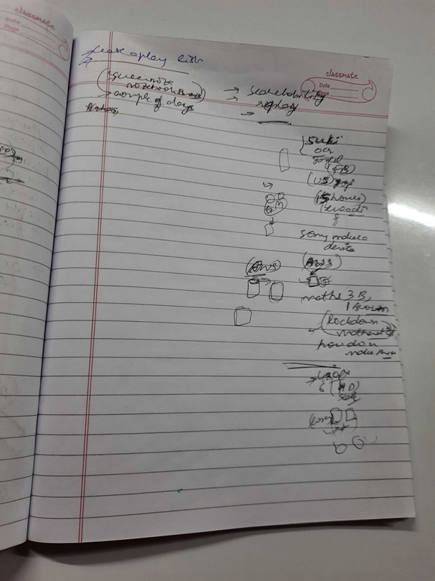
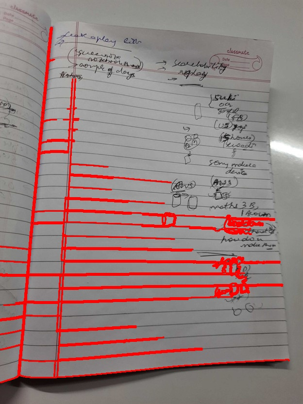

# Page Detection

## Problem
Detect the pages in an image and Draw the bounding box around them. 

## solution implemented  
I have tried detecting the page using openCv by applying different image processing steps on the image. 
The Process followed is: 

1. Covert the image to grey scale.   
    >As we need to detect the edges of the page in the image. The grey scales helps in identifying these edges. 
2. Blur the image
	> applying blur to image to remove noise and small unwanted pixel that we do not want to be detect. 
3. Edge detection using canny edge detection
	> I have used canny edge detection to detect edges around the objects present in the image. The canny detects any edges present in the image. 
4. Finding contours in the image
	-> Find contour detect all the close area in an image. We have found the contour which is polygon with 4 edges and having maximum area.
5. Display the contour on the image. 
    >We have selected the contour and shown in the image.  

## How to run?
To run the solution just downlaod and run the [main.py](main.py). After run it will ask for the path of the image to be analysed. Please provide same and it will save the result in 'output.jpg' file.

## Sample output 
|Input| Output|
|:---------------------------------------:|:---------------------------------------:|
|||
|||
|||
|||

## Conclusion
We have tried to detect the pages in image using OpenCV but we are not able to do so where there is very light/white background is use or there is lot of text is written on the Page. The Better solution will be to used image segmentation using deep learning. If trained well the deep learning model are capable detect lots of object present in the images and hence will be a better approach for this problem. However to impliment deep learning we will needs lot of data to train the  model.
